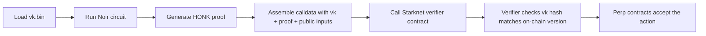
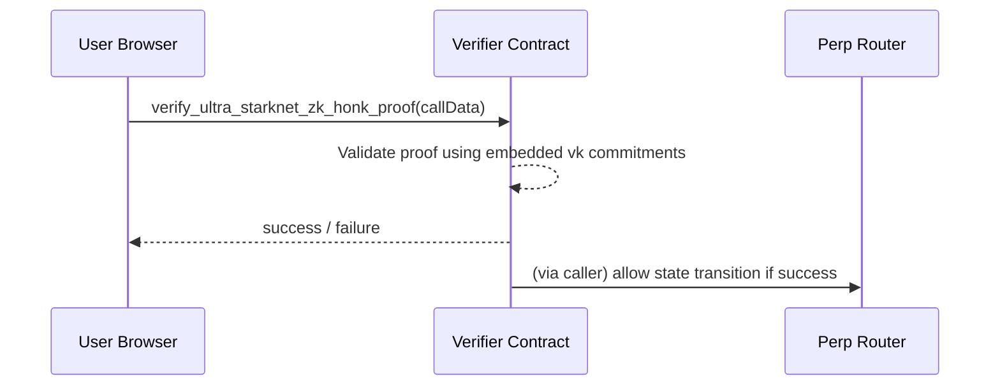

# Circuit Verifier & Verifying-Key Primer

Circuit keeps private perp logic trustless by combining local proof generation with an on-chain verifier contract. This document explains how the verifying key fits into the flow so contributors and users can reason about what gets generated, when it changes, and why it matters.

---

## What Is the Verifying Key?

- The Noir circuit that enforces our private-perp constraints is compiled once (see `circuit/target`).
- From that compilation we obtain a **proving key** (used locally) and a **verifying key** (needed by anyone who wants to validate proofs).
- Circuit ships with a single verifying key binary (`app/src/assets/vk.bin`). It is deterministic for a given circuit build: change the circuit → regenerate the key pair.
- The key never leaves the repo; we simply fetch it on the client:

```tsx
// app/src/App.tsx (excerpt)
const response = await fetch(vkUrl)
const arrayBuffer = await response.arrayBuffer()
const binaryData = new Uint8Array(arrayBuffer)
setVk(binaryData)
```

## When Do We Generate a New Key?

Only when the Noir circuit changes in a way that alters the proving system. Typical triggers:

1. New constraints or removal of existing ones.
2. Different public inputs / witness layout.
3. Switching proving backend parameters.

If the circuit logic is untouched, we reuse the existing `vk.bin`. Shipping a new circuit requires:

1. `nargo prove` / `bb prove` (depending on pipeline) to get updated assets.
2. Replace `circuit.json`, `vk.bin`, and redeploy the verifier contract compiled for the new key.
3. Update the verifier address in `App.tsx`.

## Frontend Flow



- `vk.bin` is stored in memory only; we never push it on-chain.
- The `garaga` helper encodes proof + public inputs + verifying key commitment into the format expected by the Cairo verifier.

## On-Chain Flow



- The verifier contract contains constants derived from the same verifying key embedded at build time (see `verifier/src`). As long as that key matches what the client used, proofs validate.
- Because the verifying key is fixed, we can audit and cache the contract’s constants. There’s no runtime key registration.

## Security Considerations

- **Key Integrity:** Anyone modifying `vk.bin` without redeploying the Cairo verifier would cause proof verification to fail. Treat the file as part of the trusted build artifacts.
- **Caching:** Browsers may cache `vk.bin`. When we ship a new version, bump the asset hash (Vite already includes `?url` hashing) and instruct users to hard-refresh if they still see “verifier mismatch” errors.
- **Distribution:** Since the verifying key is public, hosting it in the app bundle is fine. We only need to ensure authenticity (e.g., users load the official bundle).

## TL;DR for Users

- Circuit does **not** generate a new verifying key per trade. We ship one key per circuit deployment.
- The “WASM initialization complete / Loaded verifying key” console logs you see simply confirm the app fetched that static key and is ready to produce proofs.
- If we ever update the circuit (new features, bug fixes), we’ll cut a new verifying key, redeploy the verifier contract, bump the asset in the app, and mention it in release notes.

Feel free to link traders to this doc whenever they ask why the console logs mention verifying keys or wonder whether they need to “re-sync” their prover.***

